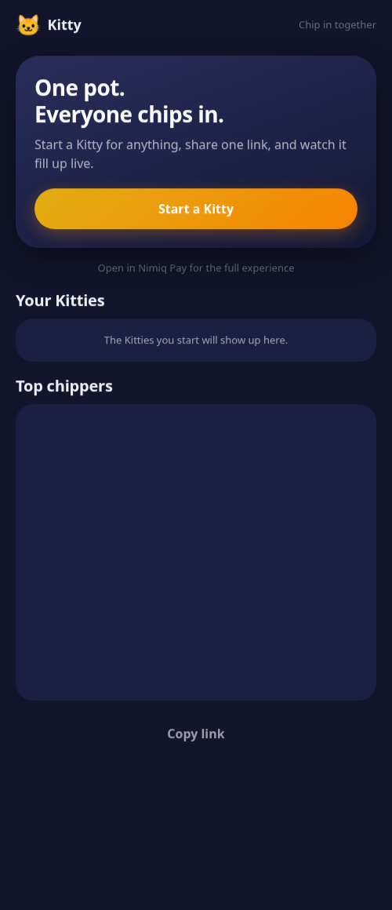
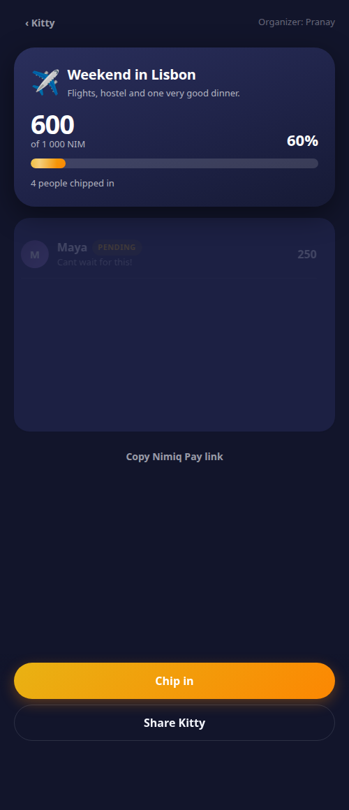
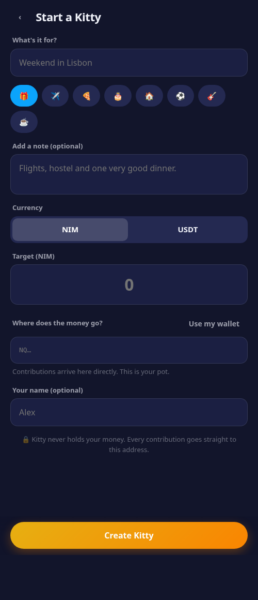

# 🐱 Kitty — chip in together

A shared money pot for groups, built as a Mini App for **Nimiq Pay**.

One person starts a Kitty for something — a trip, a leaving gift, a team lunch, a tip jar — sets a
target in **NIM** or **USDT**, and shares one link. Friends open it inside Nimiq Pay, tap *Chip in*,
and watch the pot fill up live. When it's full, the organizer pays it out.

<p align="center">
  
  
  
</p>

---

## Try it

| | |
|---|---|
| **Live app** | `https://<your-worker>.workers.dev` *(set after deploy)* |
| **Open in Nimiq Pay** | `nimiqpay://miniapp?url=https://<your-worker>.workers.dev` |
| **Example Kitty** | `https://<your-worker>.workers.dev/k/<id>` |

Kitty also runs in a normal browser. Everything except the wallet actions works there, which makes
it easy to demo and share; the wallet calls need Nimiq Pay.

---

## Why it exists

Splitting money in a group is still genuinely annoying. Somebody fronts the cost, chases everyone in
a group chat for weeks, and eats the difference. Kitty replaces that with a link.

It is also, by construction, a **multi-wallet** app: a Kitty is worthless with one person in it. Every
pot pulls a handful of people into Nimiq Pay, and every contributor lands on a success screen whose
primary action is to share it onward.

---

## How it works

### The pot is the organizer's own wallet

Kitty is **non-custodial and has no smart contract**. When you create a Kitty you nominate a payout
address — normally your own. Contributions go **straight from each contributor's wallet to that
address**. Kitty never holds, routes, or can freeze anyone's money.

"Pay out" is then just a normal outbound transaction that Kitty pre-fills with the confirmed total
and the organizer signs.

This was a deliberate trade-off. Real escrow would need a smart contract, and **Nimiq PoS has no
general smart contracts** — so an escrow design would have forced the NIM and USDT paths to diverge
completely, with NIM getting a worse product. Instead both rails behave identically, and the trust
model is the same one a physical kitty has always had: you trust the person holding it. The app says
so plainly on the create screen rather than hiding it.

### Contributions are verified on chain, not taken on trust

The database is a cache, never the source of truth for money.

1. A contribution is recorded as `pending` the moment the wallet returns.
2. The UI shows it immediately, so the bar moves the instant you pay (optimistic UI).
3. On every read, the Worker re-checks pending contributions against a public RPC node and promotes
   them to `confirmed` — or marks them `failed` if the chain contradicts them.
4. The organizer can only pay out the **confirmed** total.

An RPC that is merely unreachable never marks anything failed; it stays pending and is retried. Only
positive evidence of a bad transaction fails a row.

On the NIM side each contribution is stamped with a `kitty:<id>` memo via
`sendBasicTransactionWithData`, so a pot is **reconstructible from chain data alone** — you do not
have to trust this app's database at all. On the EVM side the Worker decodes the transaction's
`transfer(address,uint256)` calldata and checks recipient, token, sender and amount.

### Architecture

```
src/            React + TypeScript SPA (Vite)
  rails/        ← the payment abstraction; the only currency-aware code
  screens/      Home · Create · Kitty
  components/   Sheets, progress, confetti, skeletons
  i18n/         en · de · es
worker/         Hono API on Cloudflare Workers
  verify.ts     on-chain verification (NIM + EVM)
  share.ts      Open Graph injection + SVG share card
shared/         money maths, address validation, chain registry
```

One Worker serves both the built SPA and `/api/*`, so there is a single origin — which also keeps
the Mini App device identifier stable, since it is scoped per origin.

### One interface, two currencies

Every screen talks to a `PaymentRail` and never branches on which currency it is:

```ts
interface PaymentRail {
  readonly id: 'nim' | 'usdt'
  readonly symbol: string
  readonly decimals: number
  isAvailable(): Promise<boolean>
  connect(): Promise<RailAccount>
  peek(): Promise<RailAccount | null>
  contribute(p: { kittyId: string; to: string; amount: bigint }): Promise<ContributeResult>
  settle(p: { to: string; amount: bigint }): Promise<ContributeResult>
  validateAddress(address: string): boolean
  explorerTxUrl(txHash: string): string | null
}
```

`NimRail` wraps the Nimiq provider; `EvmRail` wraps `window.ethereum`. Adding a third rail means
writing one file and touching no UI.

---

## Nimiq integration

| Feature | Where |
|---|---|
| `init()` to await the injected provider | [src/rails/nim.ts](src/rails/nim.ts) |
| `listAccounts()`, `connect()` | [src/rails/nim.ts](src/rails/nim.ts) |
| `sendBasicTransactionWithData()` — stamps the `kitty:<id>` memo | [src/rails/nim.ts](src/rails/nim.ts) |
| `window.ethereum` ERC-20 transfer + chain switching | [src/rails/evm.ts](src/rails/evm.ts) |
| `getHostLanguage()` for UI language | [src/lib/host.ts](src/lib/host.ts) |
| `requestDeviceIdentifier()` for leaderboard + anti-spam | [src/lib/device.ts](src/lib/device.ts) |
| `nimiqpay://miniapp?url=…` deeplink + web fallback | [src/lib/host.ts](src/lib/host.ts) |

### Notes for anyone else building on the SDK

Three things cost me time and are not in the prose docs — all verified against
`@nimiq/mini-app-sdk@0.1.0`'s own type definitions:

1. **Provider methods return errors, they don't always throw.** Every method is typed
   `Promise<T | ErrorResponse>` where `ErrorResponse = { error: { type, message } }`. A bare
   `try/catch` reads a user rejection as *success*. Everything here goes through one `unwrap()` guard
   ([src/rails/types.ts](src/rails/types.ts)).
2. **`value` is a `number` of Luna** (1 NIM = 1e5). All money in this app is `bigint` base units and
   is only narrowed to `number` at the provider boundary, after an exactness check.
3. **Nimiq's RPC double-wraps its results** as `{"result": {"data": …, "metadata": …}}`, unlike
   standard JSON-RPC. Reading `result` directly silently yields the wrapper and every verification
   fails. Also `getTransactionsByAddress` takes **three** arguments — `(address, max, startAt|null)`
   — and rejects the call with two.

### ⚠️ On Polygon

The Nimiq docs are self-contradictory here. The *Supported Networks* list is Ethereum, Arbitrum One,
Optimism, Base, BNB Smart Chain and Sepolia — but the next sentence reads *"ERC-20 tokens on any
listed chain — including USDT on Polygon"*. **Polygon is not in that list.**

Rather than bet on which half is right, Kitty carries a [chain registry](shared/chains.ts) covering
all of them and resolves availability **at runtime** via `wallet_switchEthereumChain`, falling back
gracefully. Note that USDT on BNB Smart Chain is **18 decimals**, not 6 — which is why `decimals` is
per-chain here rather than a constant.

---

## Running it

### Prerequisites

Node 20+, and a Cloudflare account for deployment.

### Local development

```bash
npm install

# create the local D1 database and apply the schema
npx wrangler d1 execute kitty-db --local --file=./schema.sql

# terminal 1 — API + static assets on :8787
npm run build && npm run dev:api

# terminal 2 (optional) — Vite dev server with HMR on :5173, proxying /api to :8787
npm run dev
```

Open <http://127.0.0.1:8787>. Wallet actions need Nimiq Pay; everything else works in a browser.

### Deploying

```bash
# 1. create the database and copy the printed id into wrangler.toml
npx wrangler d1 create kitty-db

# 2. apply the schema to the remote database
npx wrangler d1 execute kitty-db --remote --file=./schema.sql

# 3. set APP_BASE_URL in wrangler.toml to your deployed URL, then
npm run deploy
```

Your Mini App URL is the Worker URL. The share deeplink is
`nimiqpay://miniapp?url=<that URL>`.

### Checks

```bash
npm run typecheck   # tsc across app, worker and shared
npm run test:live   # runs the on-chain verification logic against Nimiq mainnet
```

`test:live` is a live test on purpose. The entire risk in `verify.ts` is whether our assumptions
about the RPC's response shape are correct, and a mock would just encode the same assumption twice.
It caught two real bugs during development, including one where a not-yet-mined transaction could be
confirmed against a *different* payment from the same person.

---

## Deliberate limitations

Stated plainly rather than buried:

- **The organizer is trusted.** They hold the pot and choose where it goes. This is inherent to the
  non-custodial, no-contract design and is disclosed in-app. A future EVM-only escrow mode could
  remove it, at the cost of rail parity.
- **`og:image` is a static card, not per-Kitty.** WhatsApp, Telegram, X and LinkedIn all refuse SVG
  for `og:image`, and a Worker has no rasterizer. Live numbers still reach the reader through
  `og:description`, which those clients do render. Per-Kitty PNGs would need satori + resvg-wasm.
- **The device identifier is per device, not per person.** Nimiq's docs are explicit that a shared
  device returns the same value to everyone, so it gates "did this device create this Kitty" and
  nothing security-critical.
- **NIM receipts may not be canonical hashes.** The provider returns a serialized transaction rather
  than a hash, so Kitty derives a local key and reconciles the real hash from the memo. See
  `toReceipt()` in [src/rails/nim.ts](src/rails/nim.ts).
- **Contributions are read 200 at a time** and at most 5 pending rows are re-verified per request, to
  stay inside Worker CPU limits. Fine for group-sized pots; a viral pot would want a queue.

---

## Licence

MIT — see [LICENSE](LICENSE).
