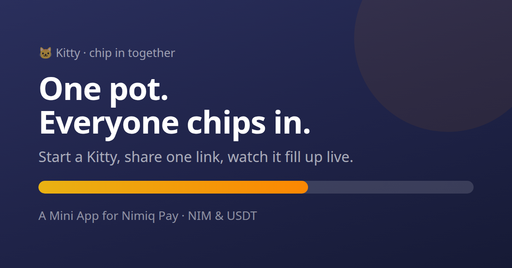

# Kitty — Submission

## Competition description (238 words — the field caps at 250)

**Kitty — chip in together**

Every group has the same broken ritual: one person pays for the trip, the leaving gift or the team
lunch, then spends weeks chasing everyone in a group chat and quietly eats the difference.

Kitty replaces that with a link. You start a pot, name what it's for, set a target in NIM or USDT,
and share it. Your friends open it inside Nimiq Pay, tap once, and the whole group watches the pot
fill up live — with a contributor wall, milestone celebrations and a progress bar that moves the
moment someone chips in.

It's for anyone who splits money with other people: friends planning a trip, colleagues buying a
leaving present, a team covering lunch, a creator running a tip jar.

Kitty is non-custodial and has no smart contract. Contributions go straight from each contributor's
wallet to the organizer's address — Kitty never holds, routes or can freeze anyone's money. Paying
out is a normal transaction the organizer signs, pre-filled with the confirmed total.

It uses the Mini Apps SDK's `init()` for the Nimiq provider, `sendBasicTransactionWithData()` to
stamp every NIM contribution with the pot's id on chain, `window.ethereum` for USDT with runtime
chain switching, `getHostLanguage()` to match the user's Nimiq Pay language (English, German,
Spanish), and `requestDeviceIdentifier()` for the leaderboard and anti-spam.

Every contribution is independently re-verified against a public RPC node before it counts.

Open source, MIT.

---

## One-pager

### 🐱 Kitty
**Chip in together.** A shared money pot for groups, inside Nimiq Pay.

---

### The problem

Splitting money in a group is still genuinely painful. Someone fronts the cost. Everyone means to
pay them back. Most people forget. The organizer chases, feels awkward about chasing, and eventually
absorbs the difference. Every existing fix is either a bank-locked app, a spreadsheet, or a group
chat with 40 unread messages.

### The product

| | |
|---|---|
| **Start a pot** | Name it, pick an emoji, set a target in NIM or USDT, nominate where the money goes. Twelve seconds. |
| **Share one link** | OS share sheet, straight into the group chat people already use. Links unfurl with live progress. |
| **Everyone chips in** | Open, tap an amount chip, approve in Nimiq Pay. Under 60 seconds from link to contribution. |
| **Watch it fill** | Live progress bar, contributor wall, messages, confetti at 25/50/75/100%. |
| **Pay it out** | The organizer signs one pre-filled transaction to wherever it needs to go. |

### Why it's built this way

**Non-custodial, no contract.** Money goes wallet → organizer, directly. Nimiq PoS has no general
smart contracts, so an escrow design would have made the NIM experience permanently worse than the
USDT one. Instead both rails are identical, and the app discloses the trust model on the create
screen instead of hiding it — the same trust a physical kitty has always required.

**The chain is the source of truth, not our database.** Each NIM contribution carries a `kitty:<id>`
memo, so any pot can be rebuilt from an RPC node alone. The server independently re-verifies every
contribution — decoding ERC-20 calldata on EVM, matching the memo on Nimiq — before it counts toward
the payout total. A contribution the chain cannot confirm never becomes spendable.

**One interface, two currencies.** Every screen talks to a `PaymentRail`; no UI code knows whether
it is moving NIM or USDT. Adding a rail is one file.

### Designed for the thumb

Mobile-first, 52px targets in the bottom dock, bottom sheets rather than centre modals, safe-area
aware, skeletons instead of spinners, real empty states, haptics on every commit, and full
`prefers-reduced-motion` support. Dark and light. English, German and Spanish, following the user's
Nimiq Pay language rather than their device locale.

### It grows by construction

A Kitty is worthless with one person in it. Every pot pulls a handful of new people into Nimiq Pay,
and every contributor lands on a success screen whose primary action is to share it onward and whose
secondary action is to start their own.

### Built with

Nimiq Pay Mini Apps Framework · `@nimiq/mini-app-sdk` · `window.ethereum` · React + TypeScript ·
Cloudflare Workers + D1 · MIT licensed.

---

### Links

| | |
|---|---|
| Live app | `https://<your-worker>.workers.dev` |
| Open in Nimiq Pay | `nimiqpay://miniapp?url=https://<your-worker>.workers.dev` |
| Source | `https://github.com/<you>/kitty` |
| Demo video | *(see [GROWTH-KIT.md](GROWTH-KIT.md) for the script)* |

---

## Pre-submission checklist

- [ ] Deployed and reachable at a public URL
- [ ] `wrangler.toml` → `database_id` and `APP_BASE_URL` set to real values
- [ ] Remote D1 schema applied (`npm run db:remote`)
- [ ] Deeplink verified from WhatsApp, Telegram and iMessage on iOS **and** Android
- [ ] One real end-to-end pot completed, including a real payout
- [ ] Both rails exercised with real funds (a NIM pot and a USDT pot)
- [ ] Rejection path checked: decline the wallet dialog, confirm it reads "Cancelled" and not an error
- [ ] Language checked by switching Nimiq Pay to German and Spanish
- [ ] Public GitHub repo, MIT licence present
- [ ] Description pasted into the portal (≤250 words, above)
- [ ] Demo video recorded with two phones
